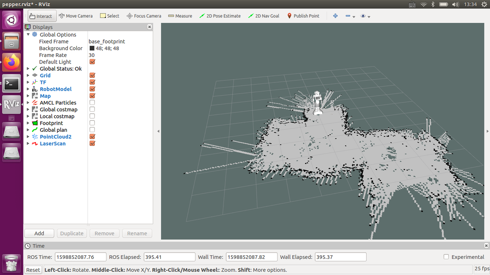
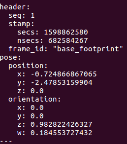

# 使用Pepper with ROS

## 1. 前言
* 在阅读本教程前，你需要有基础的Linux命令操作基础，至少需要了解什么是终端、Shell和基本vim操作。
* 本教程使用了一些ROS相关的工具如:
  * 建图: [gmapping](http://wiki.ros.org/gmapping)
  * 数据可视化: [rviz](http://wiki.ros.org/rviz)
  * 定位: [amcl](http://wiki.ros.org/amcl)
  * 路径规划和移动控制: [move_base](http://wiki.ros.org/move_base)

有关于这些工具的详细使用或本文档所带源码中各工具的详细参数配置，请参阅ROS官方WiKi链接。
* Pepper ROS 相关参考资料:
  * Pepper ROS Wiki: http://wiki.ros.org/pepper
  * 官方ROS NAOqi_driver说明: http://ros-naoqi.github.io/naoqi_driver/#
  * Pepper ROS Meta: https://github.com/ros-naoqi/pepper_robot


## 2. 软硬件环境

* 操作系统:  Ubuntu 16.04

* 机器人硬件:  Pepper 1.8a

* 机器人软件:  NAOqi 2.5.5

* ROS版本:  Kinetic 

  

## 3. 软件安装

### 3.1 Ubuntu安装

* Ubuntu16.04镜像下载：推荐使用[阿里云镜像](http://mirrors.aliyun.com/ubuntu-releases/16.04/)，官方地址在国内很慢。

* 使用USB安装Ubuntu：英文官方教程[链接](https://ubuntu.com/tutorials/create-a-usb-stick-on-windows#1-overview)，也可自行网上搜索。如果要安装双系统，搜索关键词win7/win10 + ubuntu 16.04双系统。

### 3.2 更新软件源

#### 3.2.1 Ubuntu阿里云源(可选)
因为部分镜像中的默认源已经是ubuntu官方镜像，所以替换源这一步是可选的，但在笔者的网络环境下，阿里云的源一般会更快一点。

##### 3.2.1.1  备份原始源
```bash
sudo cp /etc/apt/sources.list /etc/apt/sources.list.bak
/sources.list
```

##### 3.2.1.2  使用vi打开源列表
```
sudo vim /etc/apt/sources.list
```

##### 3.2.1.3  添加阿里云源
删除所有原始内容，并添加以下内容
```
# deb cdrom:[Ubuntu 16.04 LTS _Xenial Xerus_ - Release amd64 (20160420.1)]/ xenial main restricted
deb-src http://archive.ubuntu.com/ubuntu xenial main restricted #Added by software-properties
deb http://mirrors.aliyun.com/ubuntu/ xenial main restricted
deb-src http://mirrors.aliyun.com/ubuntu/ xenial main restricted multiverse universe #Added by software-properties
deb http://mirrors.aliyun.com/ubuntu/ xenial-updates main restricted
deb-src http://mirrors.aliyun.com/ubuntu/ xenial-updates main restricted multiverse universe #Added by software-properties
deb http://mirrors.aliyun.com/ubuntu/ xenial universe
deb http://mirrors.aliyun.com/ubuntu/ xenial-updates universe
deb http://mirrors.aliyun.com/ubuntu/ xenial multiverse
deb http://mirrors.aliyun.com/ubuntu/ xenial-updates multiverse
deb http://mirrors.aliyun.com/ubuntu/ xenial-backports main restricted universe multiverse
deb-src http://mirrors.aliyun.com/ubuntu/ xenial-backports main restricted universe multiverse #Added by software-properties
deb http://archive.canonical.com/ubuntu xenial partner
deb-src http://archive.canonical.com/ubuntu xenial partner
deb http://mirrors.aliyun.com/ubuntu/ xenial-security main restricted
deb-src http://mirrors.aliyun.com/ubuntu/ xenial-security main restricted multiverse universe #Added by software-properties
deb http://mirrors.aliyun.com/ubuntu/ xenial-security universe
deb http://mirrors.aliyun.com/ubuntu/ xenial-security multiverse
```
#### 3.2.2 ROS源(USTC)

##### 3.2.2.1 添加ROS源
```bash
sudo sh -c '. /etc/lsb-release && echo "deb http://mirrors.ustc.edu.cn/ros/ubuntu/ `lsb_release -cs` main" > /etc/apt/sources.list.d/ros-latest.list'
```
##### 3.2.2.2 配置ROS源公钥
```bash
sudo apt-key adv --keyserver 'hkp://keyserver.ubuntu.com:80' --recv-key C1CF6E31E6BADE8868B172B4F42ED6FBAB17C654
```

#### 3.2.3 更新软件源软件包列表
```bash
sudo apt-get update
```

## 3.3 安装ROS
*如需参考ROS官方文档：http://wiki.ros.org/kinetic/Installation/Ubuntu ,请从1.4章节开始阅读。*
```bash
sudo apt-get install ros-kinetic-desktop
sudo apt-get install ros-kinetic-driver-base ros-kinetic-move-base-msgs ros-kinetic-octomap ros-kinetic-octomap-msgs ros-kinetic-humanoid-msgs ros-kinetic-humanoid-nav-msgs ros-kinetic-camera-info-manager ros-kinetic-camera-info-manager-py ros-kinetic-map-server
```

## 3.4 安装其他ROS相关工具
```bash
sudo apt install python-rosdep python-rosinstall python-rosinstall-generator python-wstool build-essential
sudo rosdep init
rosdep update
```

## 3.5 安装Pepper ROS驱动
```
sudo apt-get install ros-kinetic-pepper-.*
```

## 3.6 安装Pepper Python SDK(可选)
### 3.6.1 下载Pepper Python SDK
```
wget https://community-static.aldebaran.com/resources/2.5.10/Python%20SDK/pynaoqi-python2.7-2.5.7.1-linux64.tar.gz ~

```
### 3.6.2 解压
```
cd ~
tar xvf pynaoqi-python2.7-2.5.7.1-linux64.tar.gz
```
### 3.6.3 配置环境变量
```
echo "PYTHONPATH=${PYTHONPATH}:~/pynaoqi-python2.7-2.5.7.1-linux64/lib/python2.7/site-packages" >> ~/.bashrc
```
### 3.7 安装Git
我们需要安装Git从Github中下载一些项目工程
```
sudo apt install git
```


## 4. 环境准备

### 4.1 初始化Catkin工作目录
```bash
mkdir -p ~/catkin_ws/src
cd ~/catkin_ws
catkin_make
```
### 4.2 添加ROS环境变量到Bash
```bash
echo "source /opt/ros/kinetic/setup.bash" >> ~/.bashrc
echo "source ~/catkin_ws/devel/setup.bash" >> ~/.bashrc
source ~/.bashrc
```
### 4.3 下载pepper-ros-navigation工程
```bash
cd ~/catkin_ws/src
git clone https://github.com/SoftbankRoboticsChina/pepper-ros-navigation.git
```

### 4.4 安装项目依赖
```bash
rosdep install pepper-ros-navigation
```


## 5. 启动ROS

### 5.1 启动ROS Core(可选)
如果没有启动ROS Core，在执行5.2时会自动启动。
```bash
roscore
```
### 5.2 连接Pepper
```
roslaunch pepper_bringup pepper_full.launch nao_ip:=<yourRobotIP> roscore_ip:=<roscore_ip> network_interface:=<wlp2s0|eth0|wlan0|vpn0>
```
* yourRobotIP: Pepper的IP，可以按一下Pepper胸口获得语音播报
* roscore_ip: 默认本机的话可以填127.0.0.1
* network_interface: 一般WiFi的话在ubuntu上为wlp2s0，可以执行ifconfig命令查看，请使用与Pepper所在同一网段的network_interface。
### 5.3 启动Rviz
```
rosrun rviz rviz -d ~/catkin_ws/src/pepper-ros-navigation/config/pepper.rviz
```
现在你就可以在rviz中看到虚拟的Pepper了，同时可以在rviz中可视化展现传感器数据。


## 6. 建图
请先执行5.2连接Pepper，当前建图配置会自动启动rviz，所以建图时无需执行5.3。
### 6.1记录建图初始点
为了提升之后导航时的定位准确率，建议开始建图时在地面做上标记（如粘贴胶布），记录下建图初始点。

### 6.2 启动gmapping
```bash
roslaunch pepper-ros-navigation gmapping.launch
```
这时会自动启动一个rviz窗口，在map topic中能够看到地图。

### 6.3 开始建图
打开Pepper的充电盖，然后手动推动Pepper沿着需要建图的环境缓慢移动，一般建议里墙壁或障碍物20~30厘米左右，可以多次来回移动，直到在rviz中可以显示和实际场地类似的地图。


### 6.4 保存地图
```bash
rosrun map_server map_saver -f <保存路径如:/tmp/my_map>
```
这时会生成两个文件my_map.yaml和my_map.pgm。

### 6.5 结束建图
此时你可以关闭6.2开启的终端了。


## 7. 导航(更新中)

### 7.1 启动Navigation launch
请先执行5.2连接Pepper。

```
roslaunch pepper-ros-navigation navigation.launch map_file:=/tmp/my_map
```
此时会自动启动一个rviz窗口。
### 7.2 使用Rviz控制Pepper移动

点击rivz工具顶部菜单栏的2D Nav Goal按钮，在地图上选定目标点和朝向，即可让Pepper朝指定地图内的目标移动。需要注意必须关上Pepper的充电盖。

### 7.3 获取目标点
新建终端窗口，执行以下命令
```
rostopic echo /move_base_simple/goal
```
此时，当在使用7.2的移动功能时，会在这个窗口里打印目标点的坐标，如下图。可以将此坐标记录下来，便于之后使用Python编程实现Pepper移动。



### 7.4 使用Python控制Pepper移动到指定目标点
本操作依赖于7.1，具体步骤待补充。


